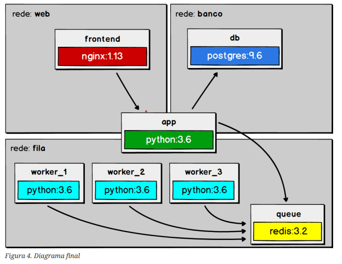
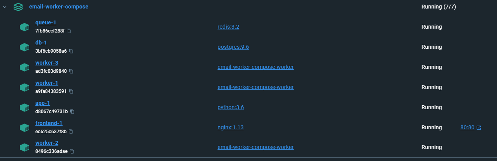

<h1 align="center">Email Sender com Workers</h1>

## 💻 Projeto

Pequeno projeto simulando um email sender com workers para compreensão da ferramenta Docker no curso "Docker: Ferramenta essencial para Desenvolvedores", ministrado por Leonardo Moura Leitao da Cod3r.

<p align="center">
  
</p>
<p align="center">Source: Apostila do curso</p>

## ⚙️ Tecnologias

- Redis(v3.2)
- Postgres(v.9.6)
- Compose Workers
- Python (v3.6)
- Nginx (v1.13)

## 🛠️ Ferramentas
- Microsoft Visual Code
- Docker Desktop
- Fork + Git Bash

## ✅ Como testar
Necessário instalação de pacotes e containers citados.

Inicialização da aplicação com 3 Workers:
```
docker-compose up -d --scale  worker=3
```

Desativação de containers:
```
docker-compose down -v
```

Verficação de quais containers estão ativos:
```
docker-compose ps
```

Verficação de logs dos Workers:
```
docker-compose logs -f -t worker
```

Verficação de dados no Postgres:
```
docker-compose exec db psql -U postgres -d email_sender -c 'select * from emails'
```

Estando a execução do compose correta, o backend estará disponível no localhost:80 (padrão), com redirecionamento para /api ao enviar mensagens.

<p align="center">
  
</p>

## :memo: Licença

Esse projeto está sob a licença MIT.